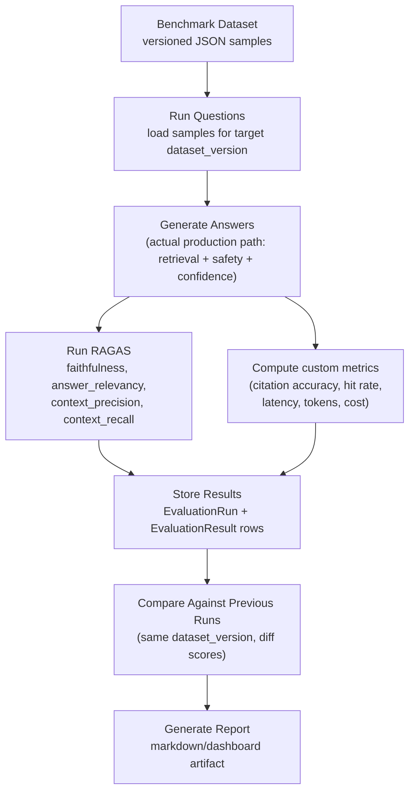
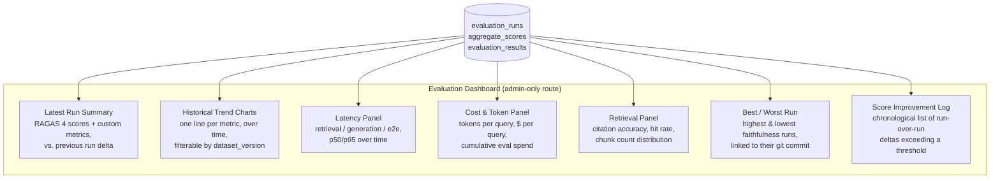

# RAG Evaluation Architecture — AI Legal Copilot

**Author:** Chief AI Engineer (repository-wide review)
**Status:** Design specification — no code implemented by this document.
**Objective:** a repeatable, measurable evaluation framework for the RAG pipeline, built on RAGAS
and a versioned benchmark dataset, that produces objective before/after numbers for every
retrieval, chunking, prompt, or model change — and, explicitly, produces the kind of measurable
engineering artifacts that translate into concrete interview claims ("improved faithfulness from
X to Y," "cut retrieval latency by X%").

This document is grounded entirely in what exists in this repository today — every "current
state" claim below references a specific file, and every recommendation builds on top of that
code rather than assuming a different system.

---

## 1. Current Repository Assessment

### Current retrieval flow

Retrieval is **per-document, hybrid dense + sparse**, implemented in
`backend/src/retrieval/retriever.py::get_retriever`:

- A FAISS similarity retriever (`vector_store.as_retriever(search_type="similarity",
  search_kwargs={"k": RETRIEVAL_K})`), `RETRIEVAL_K` defaulting to `3`
  (`config/settings.py`).
- A BM25 retriever built by pulling every chunk out of the FAISS docstore
  (`vector_store.docstore._dict`) and constructing `BM25Retriever.from_documents(...)` **fresh on
  every call** — there is no persisted BM25 index; it is rebuilt in memory each time a retriever
  is created.
- Both are combined via LangChain's `EnsembleRetriever` with configurable weights
  (`HYBRID_DENSE_WEIGHT=0.6`, `HYBRID_BM25_WEIGHT=0.4`), falling back to dense-only if BM25
  construction fails for any reason.
- In the conversational path (`services/rag_service.py::_prepare_ask`), a follow-up question is
  first rewritten to a standalone question via `rag.contextualize_chain` (using chat history) —
  **retrieval always runs against the contextualized/standalone query**, not the raw user turn.

### Current chunking strategy

`backend/src/ingestion/text_chunker.py::chunk_documents` uses LangChain's
`RecursiveCharacterTextSplitter` with `CHUNK_SIZE=500` (characters, not tokens) and
`CHUNK_OVERLAP=50`, splitting on `["\n\n", "\n", " ", ""]` in priority order. This is a generic,
document-structure-agnostic strategy — it does not specifically respect legal-document structure
(numbered clauses, defined-term boundaries, section headers), which is a concrete, testable
hypothesis the evaluation framework below is designed to validate or refute with data rather than
intuition.

### Embedding pipeline

`backend/src/ingestion/embeddings.py::create_embeddings` returns a single
`OpenAIEmbeddings(model=settings.EMBEDDING_MODEL)` client (`text-embedding-3-small` by default),
memoized process-wide via `@lru_cache` in `rag_service.get_embeddings_model()`. Embeddings are
computed once at ingestion time (`document_service` → `create_vector_store`) and persisted to
disk as part of the FAISS index — not recomputed per query (only the query string itself is
embedded at ask-time, standard RAG practice).

### Vector database

FAISS (`langchain_community.vectorstores.FAISS`), one index directory per
`(user_id, document_id)` on local disk (`ingestion/vector_store.py`), loaded with
`allow_dangerous_deserialization=True` (required by LangChain's FAISS pickle format — acceptable
here since indexes are self-produced, not externally supplied). No approximate-nearest-neighbor
tuning (FAISS's flat index does exact search) — appropriate at current per-document chunk counts
(tens to low hundreds of chunks), not a bottleneck worth evaluating yet.

### Prompt generation

Three question-type-specific prompt templates (`llm/prompt_templates.py`): `general`,
`financial`, `risk`, each with a system message embedding strict grounding rules ("Answer ONLY
using information from the provided document," "If the answer is not explicitly stated... respond
with exactly: 'This information is not found...'") and a structured answer format (FINDING /
SECTION REFERENCE / KEY TERMS / PLAIN-LANGUAGE MEANING, or the risk/financial equivalents).
`classify_question` routes between templates via keyword matching or an LLM call
(`USE_LLM_CLASSIFIER`). All system prompts are wrapped with a shared safety preamble
(`safety/prompts.py::with_safety_preamble`).

**Important divergence to note:** the *production* answer path (`rag_service.py`'s
`ConversationalRAG`, used by `ask_document`/`stream_ask_document`) is a different code path from
the *offline evaluation* chain already in the repo (`llm/rag_chain.py::build_rag_chain`, used only
by `evaluation/evaluator.py`) — the eval chain is non-conversational and does not run through the
safety-scrubbing (`safety/guardrails.py`) or confidence-scoring (`services/confidence.py`) stages
that production answers go through. **This means the existing evaluation harness does not
actually evaluate what users receive.** Closing this gap is the single most important
architectural correction this document makes (Section 5).

### Where evaluation can be inserted

Three distinct insertion points exist, each answering a different question:

1. **Retrieval-only evaluation** — immediately after `rag.retriever.invoke(standalone)` in
   `_prepare_ask`, before any LLM call. Answers "are we retrieving the right chunks?" (Context
   Precision/Recall) without paying for a generation call — the cheapest, fastest signal, and the
   right one to run most frequently.
2. **Full-pipeline evaluation** — running the *actual* production entry point (an
   evaluation-mode equivalent of `ask_document`, including safety scrubbing and confidence
   scoring) end to end. Answers "what does the user actually see, and is it faithful/relevant?"
   (Faithfulness, Answer Relevancy) — necessarily more expensive (an LLM generation call per
   question), and the point where the divergence noted above must be fixed.
3. **Log-derived evaluation** — `rag_service.py` already emits structured `log_event` calls for
   `retrieval` (chunk count, latency) and `llm_request` (model, latency) at every real user
   question. These are a free, already-instrumented source for *production* latency/volume
   metrics that complements benchmark-driven evaluation (Section 4) without needing the benchmark
   dataset at all.

### Existing strengths

- **Hybrid dense+sparse retrieval** is a well-reasoned default for contract text, where exact
  term/number/date matches matter alongside semantic meaning — not a placeholder choice.
- **Deterministic, non-LLM confidence scoring** (`services/confidence.py`) — a weighted formula
  over retrieval similarity, chunk count, citation coverage, and grounding heuristics, explicitly
  documented as "never invented by the model." This is a genuinely good engineering decision:
  it's reproducible, cheap, and auditable in a way an LLM-self-rated confidence score would not be
  — and it's a natural complement to RAGAS metrics (Section 4 treats it as an existing, free
  signal to correlate against RAGAS scores, not something to replace).
- **Output-side safety guardrails decoupled from generation** (`safety/guardrails.py`) — regex
  detection of Legal-Advice-shaped claims, applied after generation regardless of prompt
  compliance. This gives the evaluation framework a natural additional metric for free: safety
  violation rate per benchmark run (Section 4).
- **Structured, already-shipped observability** (`observability/events.py`) — latency and model
  fields are already present on every LLM/retrieval log line, meaning the performance metrics in
  Section 4 require wiring, not new instrumentation.
- **An existing RAGAS harness already in the repo** (`evaluation/evaluator.py`) proves the team
  has already selected and understood the right tool (RAGAS, with faithfulness/answer_relevancy/
  context_precision/context_recall) — this document extends and correctly wires that choice
  rather than introducing a new one.

### Existing limitations

- The eval harness tests a non-conversational chain that skips safety scrubbing and confidence
  scoring — it does not measure the production system (noted above).
- The benchmark dataset is a hardcoded 10-question Python list (`TEST_DATASET` in
  `evaluator.py`) against one fabricated sample contract, run ad hoc (`if __name__ ==
  "__main__"`) — not versioned as data, not categorized, not reproducible against a specific
  document/prompt/model version, and not persisted anywhere beyond a single overwritten
  `logs/evaluation_results.json`.
- Not wired into CI (`.github/workflows/ci-cd.yml` does not invoke it) — quality regressions in
  retrieval or prompts ship with no automated signal.
- No cost/token tracking anywhere in the evaluation path.
- No citation-accuracy metric (comparing what the system cited against what it *should* have
  cited) — RAGAS's four metrics don't cover this, and it's arguably the single most
  legally-relevant custom metric for this specific product (Section 4).
- No historical comparison — each run overwrites the previous result file, so "did this change
  make faithfulness better or worse" requires manually diffing two JSON files by hand, if the
  previous one wasn't already overwritten.

---

## 2. Benchmark Dataset Design

### Sample schema

```json
{
  "id": "nda_mutual_001_termination",
  "question": "How many days written notice does either party need to give to terminate this agreement?",
  "ground_truth_answer": "Either party may terminate the agreement with 30 days written notice.",
  "source_document": {
    "document_id": "nda_mutual_001",
    "file": "eval/datasets/v1/documents/nda_mutual_001.pdf",
    "category": "contract",
    "subcategory": "nda"
  },
  "expected_citations": [
    { "section": "Clause 8 — Termination", "page": 3, "span_hint": "30 days written notice" }
  ],
  "document_metadata": {
    "title": "Mutual Non-Disclosure Agreement (Synthetic)",
    "jurisdiction": "US-generic",
    "doc_type": "NDA",
    "page_count": 5,
    "source": "synthetic"
  },
  "difficulty": "easy",
  "category": "contract",
  "question_type": "general",
  "tags": ["termination", "notice-period"],
  "dataset_version": "v1"
}
```

| Field | Purpose |
|---|---|
| `question` | The benchmark query, phrased the way a real user of that persona would ask it. |
| `ground_truth_answer` | Human-authored (or human-reviewed) correct answer — RAGAS's `context_recall` and answer-comparison metrics depend on this being accurate, not just plausible. |
| `source_document` | Points at a fixture document checked into the repo (never a real user's uploaded document — see Section 10 on data provenance). |
| `expected_citations` | What the system *should* cite — the input to the custom citation-accuracy metric (Section 4), which RAGAS does not provide. |
| `document_metadata` | Enables per-category, per-jurisdiction, per-doc-type score breakdowns, not just one aggregate number. |
| `difficulty_level` | `easy` (single explicit fact, one clause), `medium` (requires synthesizing 2+ nearby clauses or a defined term), `hard` (requires cross-referencing distant sections, or a deliberately ambiguous/absent fact testing correct abstention). |
| `category` | Contract / IPC / Constitution / Employment / Lease / etc. — see dataset expansion below. |
| `question_type` | Mirrors the production classifier's own labels (`general`/`financial`/`risk`) so evaluation results can be sliced the same way the system routes prompts. |

A `hard` difficulty sample whose `ground_truth_answer` is explicitly "not stated in this
document" is a deliberate, important category: it tests whether the system correctly abstains
(and whether `confidence_service`'s Low-confidence path fires appropriately) rather than only
testing whether it finds present facts.

### Initial dataset size (interview-ready minimum)

**30–50 question/answer pairs across 4–6 fixture documents spanning 3–4 categories** (e.g., a
mutual NDA, a residential lease, an employment agreement, and one statutory excerpt — enough to
demonstrate the system isn't overfit to one contract shape). This is small enough for one person
to author and manually verify every ground truth in a few focused days, and large enough that
RAGAS's aggregate metrics are not dominated by one or two noisy samples — a defensible number to
cite in an interview ("a 40-question benchmark across contracts and statutory text") without
overstating rigor a solo project can actually sustain.

### Long-term dataset size

**300–500+ samples across 10+ document types/categories** (contracts: NDA, lease, employment,
vendor/services, SaaS terms; statutory: IPC excerpts, Constitution excerpts; mixed
difficulty distribution roughly 40% easy / 40% medium / 20% hard), reached incrementally (see
expansion below), not built in one pass.

### Folder structure

```
eval/
├── datasets/
│   ├── v1/
│   │   ├── manifest.json          # dataset version, sample count, category breakdown
│   │   ├── documents/             # fixture source files (synthetic/public-domain only)
│   │   │   ├── nda_mutual_001.pdf
│   │   │   └── lease_residential_001.pdf
│   │   └── samples/
│   │       ├── contract/
│   │       │   ├── nda_mutual_001_termination.json
│   │       │   └── lease_residential_001_deposit.json
│   │       └── statute/
│   │           └── ipc_001_section_covered.json
│   └── v2/                         # next dataset version, once samples/format evolve
├── results/
│   └── runs/
│       └── 2026-07-21T14-00-00Z_<git-sha>/
│           ├── run_meta.json
│           ├── per_question_results.json
│           └── ragas_scores.json
└── reports/
    └── 2026-07-21T14-00-00Z_<git-sha>.md
```

### Storage format: JSON (git) + queryable DB, not one or the other

- **Benchmark samples live as JSON files in git.** This makes every new sample reviewable in a
  pull request exactly like code — a wrong ground truth is a bug, and PR review is the right
  place to catch it. It also gives free version history (`git log` on a sample shows when/why a
  ground truth changed).
- **A `BenchmarkSample` database table (Section 6) is a derived, queryable mirror**, rebuilt from
  the JSON files at evaluation time (or on a sync step) — the DB exists so the dashboard
  (Section 7) and evaluation-run joins can filter/aggregate by category/difficulty efficiently,
  not because the DB is the source of truth. This mirrors how the codebase already treats config
  (`Settings` from env/`.env` files) as source-of-truth-in-version-control with a runtime object
  derived from it — a consistent pattern, not a new one.

### Expansion over time

- New samples are added via normal PRs, reviewed for ground-truth correctness the same as any
  other change.
- Each addition batch is tagged with a `dataset_version`; **every evaluation run records which
  dataset version it used** (Section 6), so a score change is never ambiguous between "the system
  got better/worse" and "the benchmark changed."
- A lightweight rule: never delete or silently edit an existing sample's `ground_truth_answer`
  once a run has referenced it — supersede it with a new sample id and a `superseded_by`/
  `deprecated` flag, preserving historical comparability (directly serves the "track improvements
  over time" requirement in Section 6).
- Prioritize expansion by category coverage gaps first (e.g., "we have 20 contract questions and
  zero statutory ones — add statutory next") over simply adding more of the same category, since
  category diversity is what makes the benchmark's aggregate score meaningful rather than
  overfit to one document shape.

---

## 3. RAGAS Evaluation

For each metric: what it measures, why it matters for this product specifically, a realistic
expected range (grounded in general RAGAS/production-RAG practice, not invented), and what
concretely — in this codebase — would move the score.

### Faithfulness

- **What it measures:** decomposes the generated answer into individual claims and checks each
  one against the retrieved context, scoring the fraction of claims that are actually supported.
- **Why it matters here:** this is the single most important metric for a "legal information, not
  legal advice" product — an unfaithful (hallucinated) answer is the exact failure mode the
  product's disclaimer and safety guardrails exist to prevent. Faithfulness is the closest
  automated proxy to "did we make something up."
- **Expected score range:** given the system's already-strict grounding prompts (`"Answer ONLY
  using information from the provided document,"` explicit-abstention instruction) and the
  post-hoc safety scrubbing, a reasonable **baseline expectation is 0.75–0.88** on the initial
  benchmark, with a realistic improvement target of **0.85–0.93** after tuning — claiming higher
  than ~0.93 on a legal-document benchmark should be treated skeptically rather than as a target
  to chase, since some genuine ambiguity in contract language is expected to produce occasional
  RAGAS disagreement even for a correct answer.
- **What improves it:** tighter retrieval (less irrelevant context to be unfaithful *to*), chunk
  boundaries that don't split a clause mid-sentence (testable via the chunking experiments in
  Phase 3), and — a lever already in the codebase — verifying the confidence-based abstention
  threshold (`THRESHOLD_MEDIUM`/`THRESHOLD_HIGH` in `confidence.py`) is well-calibrated, since an
  answer that should have abstained but didn't is scored as unfaithful by definition.

### Answer Relevancy

- **What it measures:** whether the generated answer actually addresses the question asked
  (typically computed by generating candidate questions from the answer and comparing embedding
  similarity to the original question).
- **Why it matters here:** the product's structured answer format (FINDING / SECTION REFERENCE /
  KEY TERMS / PLAIN-LANGUAGE MEANING) risks diluting relevancy if boilerplate sections (e.g., a
  disclaimer note appended by `confidence_service.apply_confidence_policy`) make up a large
  fraction of the answer text relative to the actual finding.
- **Expected score range:** **0.80–0.92** is a reasonable target band; well-scoped, single-fact
  "easy" questions should score at the high end, "hard"/abstention questions inherently score
  lower on this metric by design (a correct abstention is "relevant" but necessarily generic) —
  worth segmenting this metric by difficulty level rather than reporting one blended number, or
  the abstention-heavy hard bucket will misleadingly suppress the overall score.
- **What improves it:** the question-type classifier (`classify_question`) routing correctly to
  the right template, and keeping the safety/confidence-policy append (the "Confidence: Medium/Low
  — ..." note) visually/structurally separated from the core answer so it doesn't count against
  relevancy scoring of the substantive content.

### Context Precision

- **What it measures:** of the chunks retrieved, what fraction are actually relevant to the
  question — and whether relevant ones are ranked above irrelevant ones.
- **Why it matters here:** directly measures whether the hybrid FAISS+BM25 ensemble
  (`retrieval/retriever.py`) and its weighting (`HYBRID_DENSE_WEIGHT`/`HYBRID_BM25_WEIGHT`) are
  tuned well — this is the metric the chunking and hybrid-weight experiments in Phase 3 are
  specifically designed to move.
- **Expected score range:** **0.70–0.88** at `RETRIEVAL_K=3`; note explicitly that precision and
  `k` trade off against recall — this metric alone should never justify raising `k` arbitrarily,
  since more retrieved chunks near-mechanically lowers precision while potentially raising recall
  (Context Recall, next).
- **What improves it:** tuning `HYBRID_DENSE_WEIGHT`/`HYBRID_BM25_WEIGHT` empirically against the
  benchmark rather than the current fixed 0.6/0.4 default, and testing whether a smaller
  `RETRIEVAL_K` (currently 3) with better chunking retrieves less noise without losing recall.

### Context Recall

- **What it measures:** of what the ground truth says is needed to answer the question correctly,
  what fraction was actually present somewhere in the retrieved chunks.
- **Why it matters here:** this is the metric that isolates **retrieval failure from generation
  failure** — a low-confidence abstention caused by low recall is a retrieval problem
  (`retrieval_factor`/`supporting chunks` factors in `confidence.py` correctly go to 0), whereas a
  wrong answer despite good recall is a generation/prompting problem. Reporting Context Recall
  alongside the product's own confidence score lets you say precisely which layer to fix.
- **Expected score range:** **0.75–0.90**; the "hard" difficulty bucket (cross-referencing
  distant sections) is expected to score meaningfully lower here than "easy," and that gap
  *shrinking* over time (not the absolute number rising) is itself a legitimate improvement
  metric.
- **What improves it:** chunk-boundary tuning so a single relevant fact isn't split across two
  chunks that individually rank below the retrieval threshold, increasing `CHUNK_OVERLAP`, and
  testing whether structure-aware chunking (splitting on clause/section boundaries rather than
  raw character count) recovers cross-referenced facts that raw `RecursiveCharacterTextSplitter`
  currently might sever.

**Cross-cutting note on all four metrics:** RAGAS itself uses an LLM as a judge internally
(`evaluate(...)` is passed an `llm`/`embeddings` pair, per the existing `evaluator.py`) — meaning
every RAGAS run has its own cost and its own (LLM-judge) noise/nondeterminism. Section 10 covers
the implication of this for how much to trust a single-run score delta versus a trend across
multiple runs.

---

## 4. Additional Engineering Metrics

RAGAS measures *quality*; the metrics below measure *engineering* — cost, speed, and system
health — and are what turn "the model gives good answers" into "we run this efficiently at
scale," which is the more senior-engineering half of the interview story this framework is meant
to produce.

| Category | Metric | Collection method |
|---|---|---|
| **Performance** | Retrieval latency | Already logged: `rag_service.py`'s `retrieval` event (`latency_ms`, wrapping `rag.retriever.invoke`). The eval harness times the same call directly when running the full-pipeline path (Section 5), or reads it straight from captured log events during an eval run. |
| | Generation latency | Already logged: the `llm_request` event pair (started/completed) around `rag.answer_chain.invoke`. Same capture approach. |
| | End-to-end latency | Already computed per-request as `processing_time` in `rag_service.ask_document`; the eval harness records this per benchmark question directly from the function's return value — no new instrumentation needed. |
| **Cost** | Prompt tokens / completion tokens | LangChain's `ChatOpenAI` responses expose token usage (`response.usage_metadata`, or a callback handler such as LangChain's OpenAI usage callback wrapped around the eval harness's LLM calls). Capture per question, not just per run, so cost can be sliced by difficulty/category. |
| | Cost per request | Computed, not measured directly: `(prompt_tokens * input_price + completion_tokens * output_price)` against a small config-driven price table (per model, since `settings.LLM_MODEL`/`EMBEDDING_MODEL` are already configurable and prices vary by model and change over time — do not hardcode prices in logic). |
| **Retrieval** | Retrieved chunk count | Already available as `len(docs)` at the retrieval insertion point (Section 1). |
| | Citation accuracy | **Custom metric, not from RAGAS** — compare the source indices/sections the model actually cited (`[Source N]` markers, matched against `sources` metadata already built by `_sources_from_docs`) against each benchmark sample's `expected_citations`. Computed as overlap (precision/recall on the citation set) per question, aggregated per run. |
| | Retrieval hit rate | **Custom metric** — binary per question: did the chunk(s) matching `expected_citations` appear *anywhere* in the retrieved top-k, regardless of whether the model actually cited them. Distinguishes a retrieval miss (hit rate = 0) from a citation-selection miss (hit rate = 1, citation accuracy < 1) — the same "which layer is at fault" isolation Context Recall gives, but computed exactly against this product's own citation format instead of RAGAS's generic context strings. |
| **System** | Error rate | Fraction of benchmark questions that raise an exception or return an `AppError` during the eval run (an eval-mode equivalent of the exceptions already defined in `errors/exceptions.py` — `RetrievalError`, `OpenAIServiceError`, etc. are already the right taxonomy to bucket errors by). |
| | Cache hit rate | Instrument `rag_service._cache_get`/`_cache_put` (the in-process `ConversationalRAG` LRU) to count hits vs. misses during an eval run — relevant both for eval-run cost (a cold cache means every question re-embeds/reloads FAISS) and as a production health metric flagged in `PRODUCT_ARCHITECTURE.md`'s retrieval-architecture review. |
| | Average response time | Mean/median/p95 of end-to-end latency across all questions in a run — reported alongside RAGAS scores so a "faster but worse" or "slower but better" tradeoff is always visible together, never as separate, disconnected reports. |

**General collection principle:** every metric above is either already emitted by existing
`log_event` calls (performance) or is a straightforward function of data the production code
already computes (`sources`, `docs`, `processing_time`) — the evaluation framework's job is to
**capture and persist** these signals during a benchmark run, not to invent new instrumentation
inside the RAG pipeline itself.

---

## 5. Evaluation Pipeline



**Step-by-step:**

1. **Benchmark Dataset.** Load all samples for a specified `dataset_version` (Section 2) from
   `eval/datasets/<version>/samples/`. Support filtering by category/difficulty for fast,
   partial runs during active development (e.g., "just re-run the risk-category samples after a
   risk-prompt change") versus full runs before a release.

2. **Run Questions.** For each sample, prepare the question exactly as a real user would submit
   it — same `document_id` resolution, same `question_type` routing — against the corresponding
   fixture document's pre-built FAISS index (fixture documents are ingested once, ahead of time,
   using the same `ingestion/` pipeline production uses, not a separate eval-only ingestion path).

3. **Generate Answers — using the actual production path.** This is the critical fix over the
   current harness (Section 1): the eval harness must call through
   `rag_service`'s real `ConversationalRAG`/`ask_document` logic (or a thin evaluation-mode
   wrapper around it that skips only the DB-persistence side effects), so safety scrubbing and
   confidence scoring run exactly as they do for real users. An answer that got safety-scrubbed
   into a canned safe-replacement message should be visible as such in the results (and RAGAS
   faithfulness on a scrubbed answer is a meaningful, different signal than on an unscrubbed one —
   both should be captured, not conflated).

4. **Run RAGAS.** Batch the question/answer/context/ground_truth tuples into RAGAS's `evaluate()`
   call (as `evaluator.py` already does), producing per-question and aggregate scores for all four
   metrics.

5. **Compute custom metrics** (Section 4) in parallel with step 4, since they don't depend on
   RAGAS's LLM judge — citation accuracy/hit-rate, latency, tokens, cost, cache hits, errors.

6. **Store Results.** Persist one `EvaluationRun` row (run-level metadata: dataset version, git
   commit SHA, model/prompt config snapshot, timestamp) and one `EvaluationResult` row per
   question (Section 6), plus the computed `AggregateScore` rollups — never overwrite a prior
   run's results (fixing the current single-file-overwrite limitation).

7. **Compare Against Previous Runs.** Query the most recent prior `EvaluationRun` against the
   **same `dataset_version`** (comparing across dataset versions is explicitly invalid — Section
   2's versioning rule exists precisely so this comparison step is never ambiguous), compute score
   deltas per metric and per category/difficulty slice.

8. **Generate Report.** Produce a versioned artifact (Section 7) summarizing: current scores,
   deltas vs. the prior run, deltas vs. a rolling baseline (e.g., last 5 runs' average, to smooth
   RAGAS's inherent run-to-run noise — see Section 10), and any regression flags (a metric
   dropping beyond a configured threshold, e.g., >5 percentage points).

---

## 6. Database Design

Four tables, designed so that **every score is traceable to exactly which system version produced
it** — the property that makes "we improved X from A to B" a defensible claim rather than an
anecdote.

### `benchmark_samples`

Purpose: queryable mirror of the git-versioned JSON samples (Section 2).

| Column | Notes |
|---|---|
| `id` (PK, matches the JSON sample's `id`) | |
| `dataset_version` (indexed) | Which dataset version this sample belongs to. |
| `question`, `ground_truth_answer` | |
| `source_document_id`, `category`, `subcategory` | |
| `difficulty`, `question_type` | |
| `expected_citations_json` | Stored as JSON — structurally the same shape as the fixture file. |
| `deprecated`, `superseded_by_id` | Supports the "never silently edit" expansion rule (Section 2). |

**Relationships:** referenced by `evaluation_results.sample_id`.
**Future scalability:** growing to 500+ samples is a non-issue for a simple indexed table; the
important scalability property is *query* shape (filter by category/difficulty/version), not row
count.

### `evaluation_runs`

Purpose: one row per full (or partial) evaluation execution — the anchor for comparing "before"
vs. "after."

| Column | Notes |
|---|---|
| `id` (PK) | |
| `dataset_version` (indexed) | Which benchmark version this run used — the field that makes cross-run comparison valid or invalid. |
| `git_commit_sha` | Exact code version — ties a score change to a specific diff. |
| `model_config_json` | Snapshot of `LLM_MODEL`, `EMBEDDING_MODEL`, `RETRIEVAL_K`, `CHUNK_SIZE`, `CHUNK_OVERLAP`, `HYBRID_DENSE_WEIGHT`/`HYBRID_BM25_WEIGHT` at run time — the specific levers Section 3/9 experiments tune, captured automatically so "what did we change" is never reconstructed from memory. |
| `triggered_by` | `manual` \| `scheduled_ci` \| `pre_release` — supports Section 9's phased rollout (manual first, CI-scheduled later). |
| `started_at`, `completed_at` | |
| `sample_count`, `error_count` | Quick run-health glance without joining to results. |

**Relationships:** 1–N to `evaluation_results`, 1–N to `aggregate_scores`.

### `evaluation_results`

Purpose: one row per (run, sample) pair — the finest-grained data, enabling per-question
regression hunting ("which specific questions got worse"), not just aggregate drift.

| Column | Notes |
|---|---|
| `id` (PK) | |
| `run_id` (FK, indexed) | |
| `sample_id` (FK, indexed) | |
| `generated_answer` | Full text, for manual spot-audit (Section 10). |
| `faithfulness`, `answer_relevancy`, `context_precision`, `context_recall` | RAGAS scores, per question. |
| `citation_accuracy`, `retrieval_hit` | Custom metrics (Section 4). |
| `retrieved_chunk_count` | |
| `retrieval_latency_ms`, `generation_latency_ms`, `end_to_end_latency_ms` | |
| `prompt_tokens`, `completion_tokens`, `estimated_cost_usd` | |
| `confidence_score`, `confidence_level` | Captured from the product's own `confidence_service` output — enables correlating RAGAS faithfulness against the system's own (free, deterministic) confidence signal, a genuinely interesting analysis (does low product-confidence reliably predict low RAGAS faithfulness? if yes, that's a validation of the confidence heuristic itself). |
| `safety_violation` (bool) | Whether `sanitize_legal_output` fired on this answer. |
| `error` (nullable) | Exception type/message if generation failed for this sample. |

**Relationships:** N–1 to `evaluation_runs`, N–1 to `benchmark_samples`.
**Future scalability:** at 500 samples × frequent runs, this table grows linearly and
predictably — a candidate for time-based partitioning or archival of results older than N months
once run frequency in Phase 2/3 makes that relevant, not before.

### `aggregate_scores`

Purpose: precomputed rollups per run (and per category/difficulty slice within a run) — what the
dashboard (Section 7) reads directly, rather than aggregating `evaluation_results` on every page
load.

| Column | Notes |
|---|---|
| `id` (PK) | |
| `run_id` (FK, indexed) | |
| `scope` | `overall` \| `category:<name>` \| `difficulty:<level>` \| `question_type:<type>` — one row per slice, enabling the "segment by difficulty" recommendation in Section 3. |
| `mean_faithfulness`, `mean_answer_relevancy`, `mean_context_precision`, `mean_context_recall` | |
| `mean_citation_accuracy`, `mean_retrieval_hit_rate` | |
| `mean_end_to_end_latency_ms`, `p95_end_to_end_latency_ms` | |
| `total_cost_usd`, `mean_cost_per_query_usd` | |
| `error_rate` | |

**Relationships:** N–1 to `evaluation_runs`.

### Version tracking (cross-cutting, not a separate table)

Version tracking is deliberately **columns on `evaluation_runs`** (`dataset_version`,
`git_commit_sha`, `model_config_json`) rather than a separate `Versions` table — there is no
independent lifecycle for "a version" outside of the run that used it, so a join-only table would
add a relationship with no additional information. This directly supports the requirement that
"the schema should support comparing improvements over time": any two runs with the same
`dataset_version` are validly comparable, any two with different `git_commit_sha` represent a real
code change, and `model_config_json` makes it possible to answer "did this score change because of
the prompt or because someone bumped `LLM_MODEL`" without guessing.

---

## 7. Evaluation Dashboard

**Architecture only — no implementation.** Recommended as a natural extension of
`PRODUCT_ARCHITECTURE.md`'s admin-dashboard domain (Part 12/Section 2.10 of that document),
reading from `aggregate_scores`/`evaluation_runs`/`evaluation_results` (Section 6) — not a new,
separate data store.



**Section-by-section intent:**

- **Latest RAGAS scores:** four scorecards (Faithfulness/Relevancy/Precision/Recall), each showing
  current value and delta vs. the immediately preceding run on the same `dataset_version`.
- **Historical trends:** one time-series line per metric across all runs — the visual evidence
  behind every resume claim in Section 8 ("faithfulness trended from 0.79 to 0.88 over N runs").
- **Latency, token usage, cost:** separate panels rather than folded into the RAGAS scorecards,
  since these answer a different question (efficiency, not quality) and should never be
  conflated with quality scores in the same visual — this is also the direct interview-story
  material for "reduced cost per query by X%."
- **Retrieval metrics:** citation accuracy and hit rate trended the same way, plus a distribution
  (not just a mean) of retrieved-chunk-count, since a shifting distribution (e.g., more questions
  retrieving the full `k=3` vs. fewer) is itself a diagnostic signal for chunking changes.
- **Best run / worst run:** explicit call-outs (not just implied by the trend line) — genuinely
  useful for quickly finding "what did we do differently in the best run" and "what regressed in
  the worst one," each linked to its `git_commit_sha` for direct code-diff investigation.
- **Score improvements over time:** a literal changelog view (run A → run B, metric, delta,
  git commit) — this is the panel that most directly generates Section 8's resume bullets, and
  should be designed to be easy to screenshot for that exact purpose.

**Build sequencing (ties to Section 9):** Phase 1 delivers this as a **generated static markdown/
HTML report per run** (cheap, no new service, easy to commit/share) rather than a live dashboard.
Only in Phase 2, once there's a real run history to visualize, does a proper dashboard UI (a route
in the existing Next.js admin area, per `PRODUCT_ARCHITECTURE.md`) become worth building — building
the UI before there's data to show it would be effort spent before it has a payoff.

---

## 8. Resume-Oriented Engineering Metrics

Framed as concrete, defensible achievement statements — each one is only claimable once the
corresponding measurement exists (Sections 3–6), and each target below is deliberately
conservative/realistic rather than aspirational, because a claim that survives a follow-up
interview question ("how did you measure that?") is worth more than a bigger-sounding one that
doesn't.

| Resume-style achievement | Measured by | Realistic target |
|---|---|---|
| "Built an automated RAG evaluation framework using RAGAS across a N-question, multi-category legal-document benchmark, integrated into CI." | Section 5/6/9 (existence + CI wiring) | N = 30–50 at MVP, 150+ by the time this is resume-worthy as "production-grade" |
| "Improved answer faithfulness from X to Y by tuning retrieval and grounding prompts." | `evaluation_results.faithfulness`, trended | Realistic: 0.75–0.80 baseline → 0.85–0.90 after 2-3 iteration cycles (chunking, hybrid weights, abstention threshold tuning) |
| "Improved context precision from X% to Y% by tuning hybrid dense/BM25 retrieval weights." | `context_precision` | Realistic: baseline 0.70–0.75 → 0.80–0.85 (a 10–15 point / ~15-20% relative gain is a defensible, specific claim; avoid claiming >90% precision on a hybrid retriever without strong evidence) |
| "Reduced retrieval latency by X% via [specific change]." | `retrieval_latency_ms` (p50/p95) | Realistic: 15–30% reduction is achievable via a concrete lever (e.g., caching the rebuilt BM25 corpus instead of rebuilding it per-call — a real, identified inefficiency in `retriever.py` today — or reducing unnecessary FAISS score re-lookups in `_faiss_score_map`) |
| "Reduced average end-to-end response latency by X%." | `end_to_end_latency_ms` | Realistic: 10–25%, primarily from the retrieval-latency fix above plus any RAG-cache hit-rate improvement (Section 4) |
| "Reduced average cost per query by X% without degrading faithfulness." | `estimated_cost_usd` per query, reported alongside `faithfulness` so the tradeoff is explicit | Realistic: 20–40% via chunk-size/context-length tuning (smaller, higher-precision context reduces prompt tokens directly) — always paired with the faithfulness number in the same sentence, since cost reduction alone is a weak claim without proof quality didn't regress |
| "Improved citation accuracy from X% to Y%." | `citation_accuracy` | Realistic: 70–80% baseline → 85–92% after prompt/format tuning that makes citation markers more consistently emitted and matched |
| "Established a CI-gated evaluation pipeline that caught N regressions before they reached production." | `evaluation_runs.triggered_by = scheduled_ci`, regression-flag log (Section 5, step 8) | Honest N — even "1-2 caught regressions" is a legitimate, specific claim; do not inflate this number |

**General guidance:** every claim above should be stated with the *specific lever* that produced
it (hybrid weight tuning, chunk size, caching fix), not just the before/after number — the lever
is what demonstrates engineering judgment in an interview, the number alone demonstrates
measurement discipline. Both matter; neither substitutes for the other.

---

## 9. Phased Implementation Plan

### Phase 1 — Interview-ready minimum

- Benchmark dataset: 30–50 samples, 4–6 fixture documents, 3–4 categories (Section 2).
- Fix the production-path divergence (Section 1/5): evaluation runs through the real
  `ConversationalRAG`/safety/confidence pipeline, not a separate non-conversational chain.
- Wire the existing RAGAS harness (`evaluation/evaluator.py`) against the new dataset format.
- Capture latency/token/cost per question (Section 4) — all derivable from data the pipeline
  already produces, no new instrumentation inside the RAG code itself.
- Persist results to a simple structured store — even a per-run JSON file with the shape of
  `evaluation_results`/`aggregate_scores` (Section 6) is sufficient at this phase; the DB schema
  can come in Phase 2.
- Generate a static markdown report per run (Section 7), comparing against the previous run by
  hand or a small comparison script.
- **Deliverable:** a real before/after number for at least one concrete change (e.g., a hybrid
  weight or chunk-size tune), with a report artifact to show in an interview.

### Phase 2 — Production-grade evaluation system

- Full database schema (Section 6) — `benchmark_samples`, `evaluation_runs`,
  `evaluation_results`, `aggregate_scores` as real tables, not per-run JSON files.
- CI integration: scheduled (not per-PR, given RAGAS's own LLM-judge cost/latency — Section 10)
  evaluation runs, with regression alerting on significant metric drops.
- Custom metrics fully wired: citation accuracy, retrieval hit rate, cache hit rate, error rate.
- Dataset grown to 150–300 samples with better category/difficulty balance.
- Evaluation dashboard (Section 7) as a real UI route, not just static reports.

### Phase 3 — Advanced AI experimentation

- Structured, tracked experiments (not just ad hoc tuning) comparing: chunking strategies
  (character-based vs. structure-aware/clause-boundary chunking), hybrid retrieval weight sweeps,
  a reranking stage inserted between retrieval and generation, and — once
  `PRODUCT_ARCHITECTURE.md`'s AI-provider abstraction exists — **cross-provider comparison**
  (OpenAI vs. Anthropic vs. others) on the *same* benchmark, which is a strong, differentiated
  resume claim in its own right ("ran a controlled multi-provider RAGAS comparison to select the
  production model").
- Dataset expansion to 300–500+ samples, including deliberately adversarial/hard cases mined from
  (anonymized/recreated, never real user data — Section 10) production near-miss patterns.
- Prompt-version tracking as a first-class dimension in `evaluation_runs` (already structurally
  supported via `model_config_json` — Phase 3 is where prompt A/B experiments become routine
  enough to warrant dedicated tracking/reporting for them specifically).

---

## 10. Risks and Recommendations

### Ground truth dataset creation effort

Authoring accurate ground-truth answers and citations for legal text requires care — a wrong
"ground truth" silently corrupts every downstream metric. **Recommendation:** start with the
30–50 sample Phase 1 target specifically because it's small enough for careful manual authoring
and review; if LLM-assisted drafting is used to speed this up, treat every draft as unverified
until a human explicitly reviews it against the source document — never auto-accept an
LLM-generated ground truth into the benchmark.

### Evaluation cost

RAGAS uses an LLM as an internal judge (visible in `evaluator.py`'s own `evaluate(..., llm=...,
embeddings=...)` call) — every evaluation run has real dollar cost, separate from the cost of the
RAG system being evaluated. **Recommendation:** run full evaluations on a schedule (nightly/
pre-release), not per-PR; maintain a small "smoke" subset (5–10 samples) for cheap, frequent
sanity checks during active development, reserving the full benchmark for scheduled/pre-release
runs.

### Dataset bias

A fixed, small benchmark risks being implicitly overfit to — tuning decisions that improve the
benchmark's specific documents/questions may not generalize to real user documents.
**Recommendation:** track production-level signals (the system's own confidence-level
distribution across real usage, and the safety-scrub trigger rate) as an independent, parallel
check against benchmark trends — if benchmark scores rise while real-world confidence
distribution or abstention rate worsens, that's a bias signal to investigate, not something the
benchmark alone would ever reveal.

### Hallucination measurement limitations

RAGAS's faithfulness metric is itself computed by an LLM judge, which can disagree with careful
human judgment — especially on legal text where "supported by context" can be genuinely
ambiguous (e.g., a reasonable paraphrase vs. an unsupported inference). **Recommendation:**
periodically (e.g., each Phase 2 milestone) manually spot-audit a random sample of RAGAS-scored
answers against human judgment to calibrate how much to trust the automated score; treat RAGAS as
a **regression-detection signal** ("did this change make things worse") rather than an absolute,
final measure of quality ("this answer is definitively 87% faithful").

### Maintaining benchmark quality

The benchmark will drift stale as the product evolves — new document types, changed answer
formats, new prompt templates all risk making old samples less representative.
**Recommendation:** treat benchmark samples as living, versioned artifacts (Section 2's
`dataset_version` and `deprecated`/`superseded_by` fields exist specifically for this), review
them in PRs the same as production code, and assign explicit periodic-review ownership (even for
a one-person team, a recurring calendar reminder to re-read a subset of samples against current
product behavior is enough to prevent silent drift) rather than assuming the benchmark stays
correct indefinitely once written.
