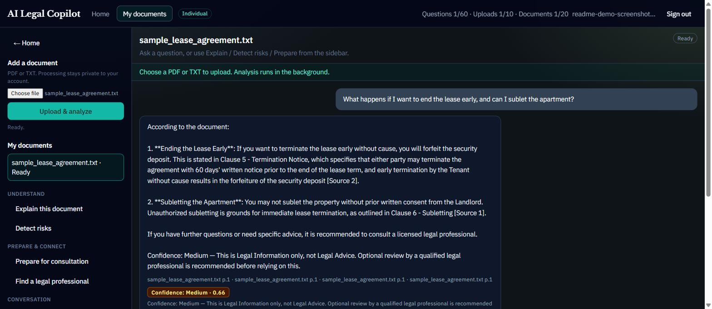
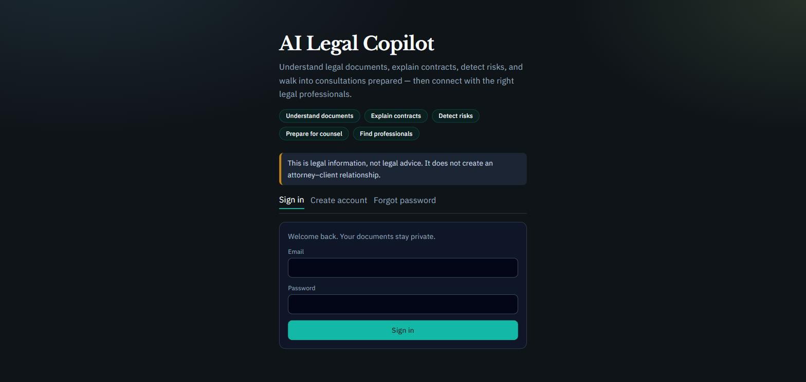
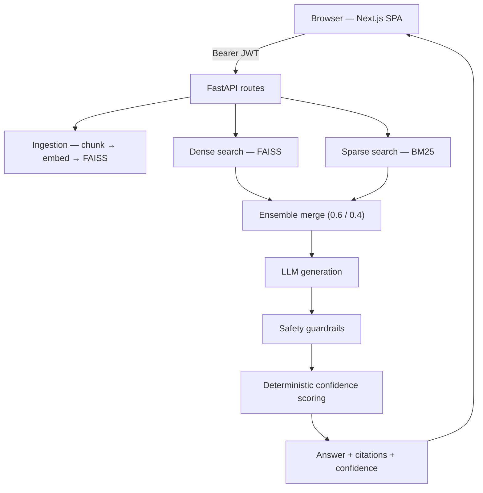
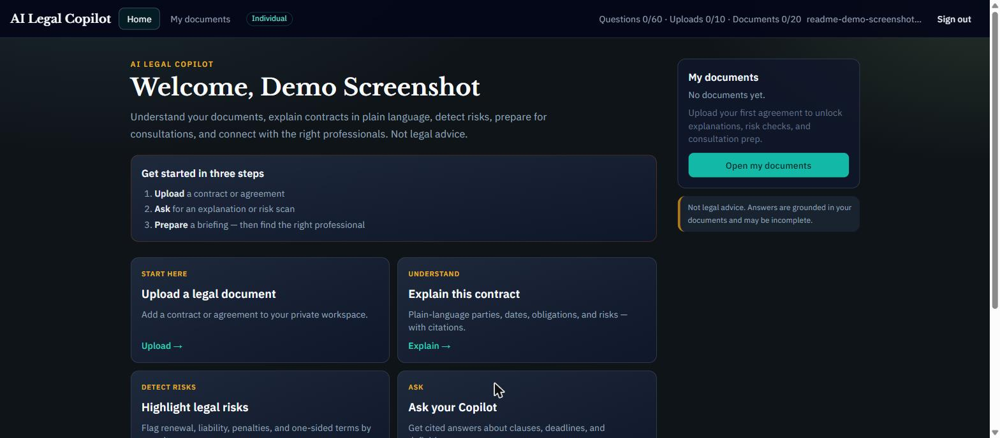

<div align="center">

# AI Legal Copilot

**Upload a contract. Ask a question in plain English. Get a cited, confidence-scored answer — never a hallucinated one.**

[](https://github.com/Krishna598-DS/legal-ai-copilot/actions/workflows/ci-cd.yml)


[**Live Demo**](https://legal-rag-t4gw.onrender.com) · [Architecture](#architecture) · [Results](#results) · [Quickstart](#quickstart) · [Roadmap](#roadmap)

</div>

<br>

<div align="center">
  
  <p><em>Every answer cites the exact clause it came from and carries a deterministic, auditable confidence score — never invented by the model itself.</em></p>
</div>

---

## What it does

Upload a contract, lease, or NDA → ask questions, get plain-language explanations, risk flags, and consultation prep, all grounded in *your* document with page-level citations. Positioned deliberately as **legal information, not legal advice** — a real architectural constraint (safety guardrails, confidence gating), not just a disclaimer.

<div align="center">
  
</div>

## Why it's engineered differently

- **Hybrid retrieval, not a single vector search.** Dense (FAISS) + sparse (BM25) retrieval combined via a weighted ensemble — legal text is full of exact-match terms a semantic-only search misses.
- **Benchmarked, not tuned by feel.** A RAGAS evaluation harness scores every retrieval/chunking decision against the real production pipeline — 141 questions, 20 synthetic legal documents, four metrics — before it ships.
- **Confidence you can audit.** Scored from retrieval strength, citation coverage, and answer grounding — deterministic and reproducible, never another LLM's opinion of itself.
- **Safety enforced in code, after generation** — a guardrail layer strips Legal-Advice-shaped claims from every response, defense in depth beyond the system prompt.
- **Built to survive real failure.** Configurable concurrency, retry logging, a data-integrity gate that refuses to report a corrupted benchmark run as valid, and checkpoint/resume that has survived actual production interruptions with zero lost work.

---

## Architecture



| Layer | Tech |
|---|---|
| Frontend | Next.js, TypeScript, Tailwind — static export, served same-origin by FastAPI |
| Backend | FastAPI, LangChain, SQLAlchemy |
| Retrieval | FAISS (dense) + BM25 (sparse) hybrid ensemble |
| LLM / Embeddings | OpenAI (`gpt-4o-mini`, `text-embedding-3-small`) |
| Evaluation | RAGAS + a custom production-path benchmark harness |
| Deployment | Docker, Render (persistent disk), GitHub Actions CI/CD |

<div align="center">
  
</div>

---

## Results

Every number below is from a checked-in, timestamped benchmark run — not a vibe.

| Change | Result |
|---|---|
| Systematic chunk-size optimization (benchmarked at every step, 141 samples) | **Faithfulness +8.8%**, **hard-question faithfulness +18%**, no recall regression |
| Eliminated a duplicate embedding call + redundant LLM classification step | **Mean latency −43%** (2.88s → 1.64s), zero quality regression |
| Persistent-disk-backed storage | User data, documents, and vector indexes now survive redeployment |

Full run history and methodology → [`evaluation/benchmark/results/`](evaluation/benchmark/results/).

---

## Quickstart

```bash
python3 -m venv venv && source venv/bin/activate
pip install -r backend/requirements.txt
cp .env.example .env   # set OPENAI_API_KEY + SECRET_KEY

export PYTHONPATH=$PWD/backend
bash backend/scripts/start.sh          # API  → http://127.0.0.1:8000
cd web && npm install && npm run dev   # UI   → http://127.0.0.1:3000
```

Full setup, CI/CD, Google Sign-In, and deployment details → [below](#development--deployment-details).

---

## Roadmap

- [ ] Benchmark and ship a `RETRIEVAL_K` / hybrid-weight sweep (next evaluation experiment)
- [ ] Migrate to managed Postgres + Alembic (schema currently additive-only on SQLite)
- [ ] Session-based auth: refresh tokens, revocation, and real RBAC (past the current single-JWT model)
- [ ] AI provider abstraction — remove direct OpenAI coupling ahead of any multi-provider routing
- [ ] Object-storage-backed vector indexes for horizontal scaling beyond one API instance
- [ ] Expand backend test coverage beyond the current liveness-only suite
- [ ] Metrics/tracing beyond structured logs; bring evaluation into CI as an automated gate

---

## Development & Deployment Details

<details>
<summary>CI/CD</summary>

GitHub Actions (`.github/workflows/ci-cd.yml`) on every PR and push to `main`:

1. **Frontend** — `npm ci`, lint, build
2. **Backend** — install deps, route smoke, pytest
3. **Docker** — build the production image

Render auto-deploys from `main` once CI is green (native GitHub integration).

</details>

<details>
<summary>Google Sign-In</summary>

1. [Google Cloud Console](https://console.cloud.google.com/) → APIs & Services → Credentials → **OAuth 2.0 Client ID** (Web)
2. Authorized JavaScript origins: `http://localhost:3000`, `http://127.0.0.1:8010`, and your production URL
3. Set `GOOGLE_CLIENT_ID` (and optional `GOOGLE_CLIENT_SECRET`) in `.env` / Render
4. UI shows **Sign in with Google** when `/auth/google/config` reports `enabled: true`

</details>

<details>
<summary>Deploy</summary>

Render uses `Dockerfile` + `render.yaml`, including a persistent disk mounted at `/app/data` so the database, uploads, and vector indexes survive redeployment. Set `OPENAI_API_KEY`, `SECRET_KEY`, and `GOOGLE_CLIENT_ID` in the service environment.

</details>

<details>
<summary>Repository layout</summary>

```
web/                            UI source (edit here)
backend/                        API + RAG pipeline (edit here)
evaluation/benchmark/           Versioned eval datasets + timestamped run history
.github/workflows/               CI/CD
Dockerfile                       production image
render.yaml                      Render config (persistent disk included)
```

</details>
